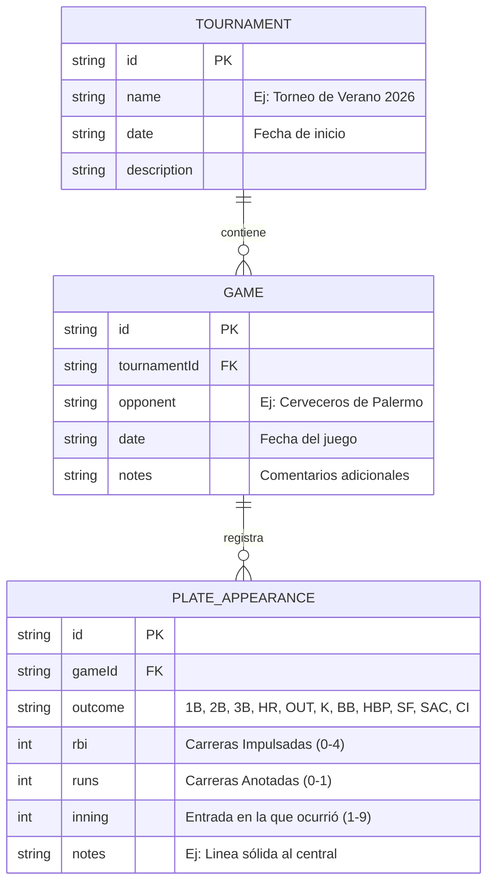

# Guía de Desarrollo y Prompt de Agente: Batting Tracker Personal (Béisbol & Softball)

Este documento contiene la especificación lógica completa para calcular tus estadísticas de bateo, el diseño de la base de datos local y una guía de diseño de interfaz de usuario. Al final, se incluye el **Prompt Maestro** listo para que se lo entregues a cualquier IA/Agente (como Bolt, v0, Cursor o Claude) y te construya la aplicación de forma inmediata y profesional.

---

## 1. Lógica y Matemáticas de Bateo

El error más común al programar una aplicación de béisbol/softball es confundir una **Aparición en el Plato (Plate Appearance - PA)** con un **Turno Oficial / Turno al Bate (At-Bat - AB)**. Si calculas el promedio de bateo dividiendo hits entre apariciones totales, el promedio será incorrectamente bajo.

### PA (Aparición en el Plato) vs. AB (Turno Oficial)

*   **Aparición en el Plato (PA):** Es el total absoluto de veces que vas a batear y se completa el turno. No importa si te dan base por bolas, si te golpean, si haces un toque o si das un hit. Todo cuenta como PA.
*   **Turno al Bate (AB):** Representa las veces que fuiste a batear y tuviste una oportunidad justa de conectar un hit. Quedan excluidos los boletos, lanzamientos golpeados, sacrificios e interferencias.
    
$$\text{AB} = \text{PA} - \text{BB (Bases por Bolas)} - \text{HBP (Golpeado)} - \text{SF (Fly de Sacrificio)} - \text{SAC (Toque de Sacrificio)} - \text{CI (Interferencia del Receptor)}$$

---

### Las Fórmulas Estadísticas Clave

#### A. Promedio de Bateo (Batting Average - AVG)
Mide el porcentaje de turnos oficiales en los que lograste un hit. Se expresa como una fracción de tres decimales (ej. `.350` o `0.350`).

$$\text{AVG} = \frac{\text{H (Hits)}}{\text{AB}}$$
*Si el jugador tiene 0 AB, el AVG debe ser `0`.*

#### B. Porcentaje de Embazado (On-Base Percentage - OBP)
Mide la frecuencia con la que logras llegar a base de forma segura (sin incluir errores defensivos ni jugadas de selección). Aquí sí se valoran las bases por bolas y los golpeados.

$$\text{OBP} = \frac{\text{H} + \text{BB} + \text{HBP}}{\text{AB} + \text{BB} + \text{HBP} + \text{SF}}$$
*Si el denominador es 0, el OBP debe ser `0`.*

#### C. Porcentaje de Slugging (Slugging Percentage - SLG)
Mide el poder del bateador calculando el total de bases alcanzadas por cada turno oficial. Los hits de extrabase tienen más peso.

Primero calculamos las **Bases Totales (Total Bases - TB)**:
$$\text{TB} = \text{Sencillos (1B)} + (2 \times \text{Dobles (2B)}) + (3 \times \text{Triples (3B)}) + (4 \times \text{Home Runs (HR)})$$
*Nota: $\text{Sencillos (1B)} = \text{Hits Totales (H)} - \text{Dobles (2B)} - \text{Triples (3B)} - \text{Home Runs (HR)}$*

Luego dividimos entre los turnos oficiales:
$$\text{SLG} = \frac{\text{TB}}{\text{AB}}$$

#### D. OPS (On-Base Plus Slugging)
Es la suma directa de OBP y SLG. Es la estadística moderna preferida para evaluar el impacto total de un bateador.
$$\text{OPS} = \text{OBP} + \text{SLG}$$

---

### Matriz de Efectos por Resultado del Turno

Esta tabla resume cómo cada tipo de evento en el plato afecta los contadores del sistema:

| Resultado | Abreviación | PA | AB | H (Hit) | TB (Bases) | Explicación |
| :--- | :---: | :---: | :---: | :---: | :---: | :--- |
| **Sencillo** | `1B` | +1 | +1 | +1 | +1 | El bateador llega a 1ª base con un hit limpio. |
| **Doble** | `2B` | +1 | +1 | +1 | +2 | El bateador llega a 2ª base con un hit limpio. |
| **Triple** | `3B` | +1 | +1 | +1 | +3 | El bateador llega a 3ª base con un hit limpio. |
| **Home Run** | `HR` | +1 | +1 | +1 | +4 | Cuadrangular. Da la vuelta a todo el cuadro. |
| **Out Defensivo** | `OUT` | +1 | +1 | 0 | 0 | Flyouts, groundouts o jugadas de selección. |
| **Ponche** | `K` | +1 | +1 | 0 | 0 | Ponche tirándole (Ks) o mirando (Kc). |
| **Base por Bolas** | `BB` / `IBB` | +1 | 0 | 0 | 0 | Boleto normal o intencional. **No cuenta como AB**. |
| **Golpeado** | `HBP` | +1 | 0 | 0 | 0 | Golpeado por lanzamiento. **No cuenta como AB**. |
| **Fly de Sacrificio** | `SF` | +1 | 0 | 0 | 0 | Fly de out que impulsa carrera. **No cuenta como AB** (afecta OBP). |
| **Toque de Sacrificio**| `SAC` | +1 | 0 | 0 | 0 | Toque de bola que avanza corredores. **No cuenta como AB**. |
| **Interferencia** | `CI` | +1 | 0 | 0 | 0 | El catcher obstruye el swing. **No cuenta como AB**. |

---

## 2. Modelo de Datos Simplificado (Single-Player)

Para tu aplicación personal, no requieres modelar jugadores defensivos, rosters o lineups complejos. Necesitas una estructura orientada a **ti mismo** como el único protagonista.



---

## 3. Guía de Interfaz de Usuario (UX/UI) Intuitiva

Dado que usarás la aplicación en el **dugout (banca)**, sudado, con adrenalina y posiblemente con prisa, la experiencia de usuario debe seguir tres principios:

1.  **Regla de los 2 Toques:** Registrar un turno al bate debe tomar como máximo 2 taps desde la pantalla principal.
2.  **Mobile-First Absoluto:** Todo debe estar al alcance del pulgar. Botones enormes, sin dropdowns minúsculos.
3.  **Carga Cognitiva Cero:** Las estadísticas críticas (AVG y OBP) deben ser el centro de atención con un diseño visualmente imponente.

### Componentes de UI Recomendados

*   **El "Dugout Dashboard" (Panel Principal):**
    *   Un selector rápido en la parte superior para elegir el **Torneo Activo** (o ver "Todos").
    *   **Tarjetas de Estadísticas Principales** con estética de *Glassmorphism* (fondo oscuro translúcido con desenfoque, bordes finos de neón).
    *   **Bending Gauges / Anillos de Progreso:** Un anillo visual para tu **AVG** (ej. si bateas `.350`, un anillo verde esmeralda lleno al 35%) y otro para tu **OBP**.
    *   **Botón Flotante de Acción Rápida (FAB):** Un gran botón verde con un símbolo `+` posicionado abajo a la derecha que abre instantáneamente el modal de registro de turno.

*   **Modal de Registro Ultra-Rápido ("Quick Add"):**
    *   No abras formularios largos. Usa una cuadrícula de botones grandes con los resultados más comunes (`1B`, `2B`, `3B`, `HR`, `OUT`, `K`, `BB`, `SF`).
    *   **Selector de RBI instantáneo:** Botones rápidos `[ 0 ] [ 1 ] [ 2 ] [ 3 ] [ 4 ]` para marcar las carreras empujadas.
    *   **Interruptor de Carrera Anotada:** Un simple switch de sí/no `[ Anoté Carrera? ]`
    *   **Smart Defaults:** Automáticamente selecciona el último partido creado y la entrada lógica sugerida (se incrementa sola según los turnos previos).

*   **Estética Visual Premium:**
    *   **Fondo:** Modo oscuro por defecto (Dark Charcoal `#121212` o Slate `#0f172a`). Evita el negro puro para evitar fatiga visual bajo la luz del sol.
    *   **Colores Acento:**
        *   `Verde Césped` (`#10b981` o HSL verde esmeralda vibrante) para representar hits, AVG alto y acciones positivas.
        *   `Naranja/Rojo Neón` (`#f43f5e`) para Ponches u Outs cuando sea necesario, pero de forma sutil.
        *   `Dorado Premium` (`#f59e0b`) para Home Runs y logros especiales.
    *   **Tipografía:** Inter o Roboto con pesos fuertes en los números estadísticos para hacerlos resaltar (ej. un `.412` en tamaño gigante con peso `900`).

---

## 4. Prompt Maestro para el Agente (Copy-Paste)

Copia y pega el siguiente prompt completo en el asistente de desarrollo que vayas a usar.

```markdown
Actúa como un desarrollador frontend experto, UI/UX designer de élite y especialista en béisbol/softball. Quiero que construyas una aplicación web mobile-first de alto impacto llamada "Batting Tracker" (o "PromedioApp") diseñada específicamente para que UN SOLO JUGADOR (yo) lleve el control absoluto y rápido de su promedio de bateo, torneos y turnos.

Usa la siguiente pila tecnológica:
- Core: React 19 con TypeScript
- Estilos: TailwindCSS (diseño moderno, premium, modo oscuro refinado con glassmorphism y acentos verde esmeralda)
- Iconos: lucide-react
- Almacenamiento: LocalStorage del navegador para persistencia inmediata (sin bases de datos complejas para poder usarse offline al instante), con una estructura de datos limpia que permita una futura exportación/importación en formato JSON.

Sigue rigurosamente estas especificaciones:

1. LÓGICA DE BATEO EXACTA (CRÍTICO)
Debes implementar de forma perfecta los cálculos de béisbol/softball:
- PA (Plate Appearances) = Total de turnos ingresados.
- AB (At-Bats) = PA - BB - HBP - SF - SAC - CI.
- AVG (Batting Average) = H / AB. Si AB es 0, mostrar ".000". Formatear como string de tres decimales (ej: .350, o .000 si no hay turnos oficiales).
- OBP (On-Base Percentage) = (H + BB + HBP) / (AB + BB + HBP + SF).
- SLG (Slugging Percentage) = TB / AB. Donde TB (Total Bases) = 1B + (2 * 2B) + (3 * 3B) + (4 * HR). Los sencillos se deducen: H - 2B - 3B - HR.
- OPS = OBP + SLG.
- Mantén un historial acumulado de carreras anotadas (R) e impulsadas (RBI).

2. MODELO DE DATOS (LOCAL STORAGE)
Define tipos TypeScript robustos para:
- Tournament: { id: string, name: string, date: string, description?: string }
- Game: { id: string, tournamentId: string, opponent: string, date: string, notes?: string }
- PlateAppearance: { id: string, gameId: string, outcome: '1B' | '2B' | '3B' | 'HR' | 'OUT' | 'K' | 'BB' | 'HBP' | 'SF' | 'SAC' | 'CI', rbi: number, runs: number, inning: number, notes?: string }

3. INTERFAZ DE USUARIO E INTERACCIÓN (UX/UI PREMIUM)
- Diseña un dashboard responsivo optimizado para móviles (Mobile-first).
- Visualización de estadísticas del torneo seleccionado (o "Global"): Tarjetas tipo cristal translúcido con desenfoque de fondo, bordes sutiles y números estadísticos en tipografía gigante y gruesa.
- Diseña un componente visual dinámico (como un semi-anillo o barra de progreso circular fluida con gradientes) para el AVG y el OBP.
- Filtro rápido de torneos en la cabecera.
- ACCIÓN RÁPIDA DE 2 TAP: Un gran botón flotante "+" en la esquina inferior derecha para agregar un turno. Al pulsarlo:
  a. Si no hay juegos creados en el torneo actual, debe permitir crear un juego rápidamente en el mismo modal con solo ingresar el nombre del oponente.
  b. Presentará un teclado visual de botones gigantes para el resultado (1B, 2B, 3B, HR, OUT, K, BB, HBP, SF, SAC).
  c. Botones rápidos para seleccionar RBI (0, 1, 2, 3, 4) y un switch para Carrera Anotada.
  d. Guardado instantáneo con un toque.
- Listado detallado e intuitivo de turnos recientes agrupados por partido, con posibilidad de editar o eliminar cualquier turno si hubo una equivocación táctil.

4. SECCIÓN DE GESTIÓN
- Vista o modal para crear y administrar Torneos (añadir, editar, borrar).
- Vista o modal para crear y administrar Partidos dentro de cada torneo.
- Botones de utilidad para:
  - "Limpiar Datos" (con confirmación de seguridad).
  - "Exportar Copia de Seguridad" (descarga un archivo .json con todos los torneos, juegos y turnos).
  - "Importar Copia de Seguridad" (carga un archivo .json para restaurar los datos).

Por favor, crea un diseño visualmente espectacular que parezca una aplicación nativa premium. Utiliza gradientes suaves, micro-animaciones en los botones al hacer tap, y notificaciones interactivas tipo toast cuando se registra un hit o un Home Run (¡haz que se sienta gratificante registrar un Home Run con alguna animación de confeti o colores dorados!).
```
